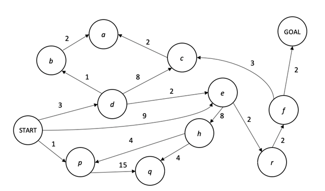

# Assignment 2 (Graph-based Path Planning)

---
Brian Atkinson <br>
300088157 <br>
Tuesday Jan 24, 2023 <br>
COMP_361 <br>
Amir Shabani, PhD. P.Eng

---
## Build
- In order to build the package it is recommended to start a python venv. Then run the following commands.
`Install all the required packages to build the binary` using `pip install -r Requirements.txt`<br>

- Command to build the gui. Places the file in <cwd>/dist/ `pyinstaller simulation.spec`


## Run
This program is easy to run, the -h flag can be set for quick reminders.
example of execution after build: 
```bash 
./dist/simulation
```

## Contributors
Project Lead: Amir Shabani <br>
Lead Developer: Brian Atkinson<br>

---

## ASSIGNMENT GUIDLINES
## Objective: 
- Examine a graph-based path planning algorithm for robot motion planning.<br>
- For Path planning, the computing agent of a driverless car (e.g., robot) has access to the given directed graph that shows the road network where nodes are representing different cities, edges are the roadways, and their weights/costs are the distance in miles.<br>
<ol>
<li><strong>[30 marks]:</strong> Use Grassfire algorithm and determine the optimum path from the START node to the GOAL node.</li>
<li><strong>[40 marks]:</strong> Use Dijkstra's algorithm to find all the shortest paths from the START node to the GOAL node.</li>
<li><strong>[30 marks]:</strong> Explain the difference between the algorithms and their solutions for this given problem.</li>
</ol>




## Submissions:

1.	Please submit your work (files and codes) on BB under “Course Content/Student Submissions” folder. 
2.	You also need to record a video (roughly about 3min, not more than 5min) and demo your code for part 2. 
You need to explains clearly your approach, run your code, and demonstrate your solution. Provide the link to your video (on Youtube/Vimeo/GoogleDrive…) in the body of your submission. Make sure the like in accessible for me to watch to evaluate your work.

The video component is worth 60% of the mark for part 2 of the assignment.


